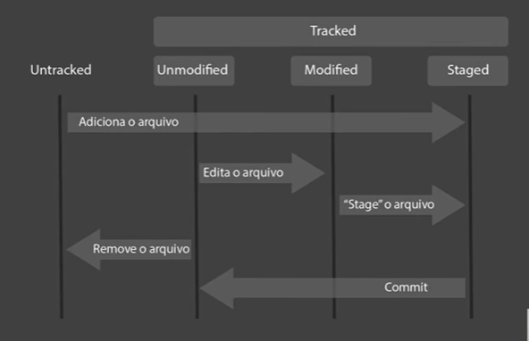

# Módulo I

Guia:

## Visão Geral do Pensamento Computacional

### Aula 1 - Visão Geral

Objetivo:

Apresentar os conceitos que caracterizam o pensamento computacional, permitindo que o Dev entenda o que significa pensar computacionalmente

Etapa 1: Introdução

- Muito atribuído a ciência da computação;
- Refere-se ao processo de pensamento envolvido na expressão de soluções em passos computacionais ou algoritmos que podem ser implementados no computador;
- De forma geral, é uma formulação e resolução de problemas sistemática e eficiente, de modo tanto um ser humano e uma máquina podem fazer;
- Não é uma disciplina acadêmica, mas sim uma habilidade generalista;
- Na área de ciências exatas, é utilizado de maneira quase intuitiva;
- Baseado em quatro pilares:
    - Decomposição: dividir um problema complexo, com muitas variáveis e contexto complexo, de forma a segmentá-lo e facilitar sua resolução;
    - Reconhecimento de padrões: Identificação através de similaridades e diferenças entre os problemas, definindo assim um padrão comportamental (tendências);
    - Abstração: parte da particularidade e extrapolá-lo de tal forma que ele se torne generalista;
    - Design de algoritmos: automação, ou seja, o passo-a-passo da resolução do problema.
- Além destes pilares, é necessário que haja um processo contínuo da suas atividades, para que a solução seja cada vez mais otimizado e eficiente. Para isso, é importante que a pessoa defina uma solução, teste a solução e aperfeiçoe a solução encontrada;
- O pensamento computacional utiliza o melhor dos dois mundos, ou seja, a abstração, detecção dos padrões e expressão de solução do ser humano com a habilidade da execução e resolução dos problemas do pensamento computacional;
- Uma outra etapa inerente ao processo, embora seja complementar, é:
    - O raciocínio lógico, para que se possa resolver problemas com eficiência;
    - Refinamento, para que a sua solução seja cada vez melhor;
- Pilares:
1. CS + Math: Desenvolvimento e abstração; Reconhecimento de padrões...
2. CS + Sci/Eng: Análise de dados e design de soluções; Definição e uso de abstrações; Teste e refinamento de algoritmos...
3. CS + Sci/Eng + Math: Modelagem; Definição de problemas; Definição e uso de abstrações; Reconhecimento de padrões...
4. Math + Sci/Eng: Desenvolvimento e abstração; Reconhecimento de padrões...
    
    Exemplos:
    
    - Química: Aperfeiçoamento de reações químicas pela utilização de algoritmos, através da identificação de químicos;
    - Engenharia: Simulações de aeronaves executadas via software em detrimento do túnel de vento;
    - Biologia: Modelagem e mapeamento do genoma humano;
    - Computação: Simulação de problemas de alta ordem em supercomputadores;
- Competências:
    - Pensamento sistemático;
    - Colaboração dentro da equipe;
    - Criatividade e design;
    - Facilitador;

Etapa 2: Habilidades Complementares

Habilidades:

- Raciocínio Lógico
- Refinamento

Raciocínio lógico:

- Definição: é uma forma de pensamento estruturado, ou raciocínio, que permite encontrar a conclusão ou determinar a resolução de um problema;
- Essa habilidade não é ensinada, mas sim é muito por treinamento. Ou seja, quanto mais você desenvolver esse tipo de raciocínio, mais internalizado ele está;
- Classificação em três tipos:
    - Indução: dado o fenômeno que estou observando, vou extrapolá-lo para o campo das ideias e levá-lo em confronto às leis e teorias, entrando no campo das ciências experimentais;
    - Dedução: de forma inversa à dedução, a partir das leis e teorias será feita uma dedução de previsões e explicações, entrando no campo das ciências exatas;
    - Abdução: parte da conclusão para o estabelecimento de uma premissa, como por exemplo, a frase "A grama está melhorada" pode trazer a premissa que "deve ter chovido". Ele é muito utilizado em processos investigativos e diagnósticos.
- De forma a segmentar a estrutura, temos:

Aperfeiçoamento:

- Consiste em melhoramento, aprimoramento, refinamento, ato de aperfeiçoar...
- A partir de uma solução, determinar pontos de melhora e refinamento;
- O ato de aperfeiçoar seria:
    - Encontrar solução eficiente;
    - Otimizar processos;
    - Simplificar linhas de código;
    - Funções bem definidas;
    - Com as duas primeiras, temos o melhor uso de recursos, enquanto com as duas outras melhoramos códigos e algoritmos
- Isso é um processo contínuo, presente em todas as etapas
- Vantagens:
    - Maior compreensão
    - Mais eficiência
    - Menos tempo
    - Menos armazenamento, etc.

### Aula 2: Pilares

Objetivo:

É preciso compreender como executar cada etapa de um pensamento computacional. Dessa forma, esta aula é dedicada à compreensão individual de cada pilar desse processo de pensamento.

Etapa 1: Decomposição

> "If you can't solve a problem, then there is an easier problem that you can solve: find it" - George Polya, professor e matemático
> 
- Primeiro passo da resolução de problemas dentro do conceito de pensamento computacional:
    - "Dado um problema complexo, devemos quebra-lo em problemas menores. Portanto, problemas mais fáceis e gerenciáveis.”
- A primeira fase é determinada análise:
    - Definição: Processo de quebrar e determinar partes menores e gerenciáveis;
    - Essa é a etapa que se estuda e explora o problema, realizando um exame detalhado e decompondo-o em elementos constituíntes
- A segunda etapa é a síntese:
    - Definição: combinar os elementos recompondo o problema original;
    - Uma vez que o problema foi desmembrado, a síntese é o processo de reconstrução, de maneira a fundir os elementos distintos de maneira coerente e consistente em um único elemento;
- Ordem de execução de tarefas menores pode variar entre sequencial e paralelo:
    - Em sequencial: depende de outras tarefas, sendo executadas em fila;
    - Em paralelo, realiza-se as tarefas de maneira concomitante, ganhando eficiência e realizando o trabalho em menos tempo;
- A decomposição é muito útil, mas não basta somente aplicá-la, e sim desenvolvê-la por si mesmo, sem modelos.
- Como decompôr?
    - Identificar os componentes;
    - Veja se há características e dependências entre eles;
    - Reduza-os em problemas maiores;
    - Recomponha o problema original à medida que eles forem sendo solucionados;

Etapa 2: Padrões

- Reconhecimento de Padrões
    - Modelo base
    - Estrutura invariante
    - Repetição
    - Surge para determinar o modelo através de similaridades e diferenças
- Por que determinar padrões?
    - É uma forma de generalização, com objetivo de obter resolução para problemas diferentes;
- Classificação de objetos desconhecidos
    - Através de aspectos de classes e categorias, variando do domínio e o objeto trabahando
- Como o computador reconhece padrões?
    - O ser humano reconhece por processos de similaridades (comparação), ou seja, grupos conhecidos x objeto desconhecido;
    - No computador, é necessário o ensinamento:
        - Primeiramente, através da representação de atributos, ou seja, determinação do que cada um significa;
        - Aprendizado -  conceito associado ao objeto
        - Armazenamento de dados
        - Por fim, regras de decisão, ou seja, passos que determinam como o computador vai reagir dentro daquelas condições
- Aplicações:
    - Classificação de dados;
    - Reconhecimento de imagem;
    - Reconhecimento de fala;
    - Análise de cenas;
    - Classificação de documentos
    

Etapa 3: Abstração

- Três conceitos básicos:
    - Abstrair: observar, um ou mais elementos, avaliando características e propriedades em separado;
    - Abstração: processo intelectual de isolamento de um objeto da realidade;
    - Generalizar: tornar-se geral, mais amplo, extensão
- O que é generalização?
    - Na lógica, é a operação intelectual que consiste em reunir numa classe geral, um conjunto de seres ou fenômenos similares
- Como classificar os dados?
    - Características
    - Pontos essenciais: cada objeto terá suas características essenciais
    - Generalizar x detalhar: é necessário abstrair os detalhes e generalizá-lo para classificá-lo
    - Com isso, conseguimos uma representação daquele objeto
- Conceitos baseados em abstrações:
    - Algoritmos
    - Estruturas de dados
    - Máquina de estado
    - Linguagens de programação
    - No mundo de rede, existe a parte de comunicação
        - Comunicação síncrona ou assíncrona
        - Arquitetura paralela (paralelização), etc
    - Dentro das arquiteturas:
        - Por servidor
        - Por camadas
        - Por ponto-a-ponto
        - Em formato estrela, etc.
    

Etapa 4: Algoritmos

- Principal pilar dentro do pensamento computacional
- O objetivo principal do computador:
    - Receber, manipular e armazenar dados
    - Isso é feito através de programas, com uma série de instruções definidas por aqueles que o fazem
- Como seria um algoritmo?
    - Processo de resolução de problemas "step by step", utilizando instruções
    - Ele também precisa ser entendido por um humano e uma máquina
- No processo de desenvolvimento de um programa, envolve-se:
    - Análise: estudo de definição do programa
    - Algoritmo: descreve o problema por meio de ferramentas narrativas, fluxograma ou pseudocódigo;
    - Codificação: o algoritmo é codificado de acordo com a linguagem de programação escolhida
- O algoritmo, portanto, é:
    - Sequência de passos com objetivo definido
    - Execução de tarefas específicas
    - Conjunto de operações que resultam em uma sucessão finita de ações
- Como construir um algoritmo?
    - Compreensão do problema: definição dos pontos mais importantes
    - Definição dos dados de entrada: quais são os dados que serão fornecidos e os inerentes ao ambiente que está sendo trabalhado;
    - Definir processamento: quais são os cálculos e operações, ou restrições atrelados àquele problema;
    - Definir dados de saída: quais serão os dados esperados após o processamento e, a partir deste dados, quais serão os próximos passos a serem realizados;
    - Utilizar um método de construção: definição de como esse método será construído dentro daquela linguagem
    - Teste e diagnóstico: etapa de aprimoramentos e certezas
- Métodos de construção:
    - Narrativa:
        - Mais intuitivo e mais fácil, sendo utilizado no método natural de linguagem do ser humano;
        - Vantagem: Simples e mais fácil de ser utilizado, com uma curva de aprendizado baixa;
        - Desvantagem: Pode possuir diversas interpretações possíveis;
    - Fluxograma:
        - Utilização de artifícios ou símbolos pré-definidos para comunicação;
        - Vantagem: Ele é de simples entendimento;
        - Desvantagem: Carrega conceitos novos, necessitando de conhecimento prévio da estrutura e dos símbolos empregados;
    - Pseudocódigo:
        - É o que existe quando se está aprendendo a linguagem de programação
        - Vantagem: regras pré-definidas e passo-a-passo a serem seguidos, parecido com a codificação

## Lógica de Programação Essencial

### Aula 1: Introdução à Lógica e à programação

Entendendo o que é lógica

- Programar é resolver problemas;
- Não vá diretamente para o código: é importante ter as habilidades de lógica antes
- O que é lógica?
    - Coerência de raciocínio, de idéias
    - Lógica de programação significa apenas contextualizar a lógica na programação de computadores, buscando a melhor sequência de ações para solucionar um problema
- Metacognição
    - "Pensar como você pensa”
- Abstração
    - É a habilidade de concentrar nos aspectos essenciais de um contexto qualquer, ignorando características menos importantes ou acidentais

O que são algoritmos e pseudocódigos

- O que é um algoritmo?
    - É uma sequência de passos que resolve um problema
- O que é um pseudocódigo?
    - É uma forma genérica de escrever um algoritmo, utilizando uma linguagem simples (nativa, ou seja, em português a quem o escreve, de forma a ser entendido por qualquer pessoa)
    - Apenas utilizado para aprender a programar

Aprendendo fluxograma, variáveis e constantes

- O que é um fluxograma?
    - É uma ferramenta utilizada para representar graficamente o algoritmo, isto é, a sequência lógica e coerente do fluxo de dados
    - É um tipo de diagrama e pode ser entendido como uma representação esquemática de um processo. Podemos entendê-lo, na prática, como a documentação dos passos necessários para a execução de um processo qualquer
- Diagrama de blocos
    - Utilizado para representar o método do fluxograma
- O que são variáveis?
    - Na programação, uma variável é um objeto (uma posição, frequentemente localizada na memória) capaz de reter e representar um valor ou expressão
    - É um espaço na memória do computador destinado a um dado que é alterado durante a execução do algoritmo
- Tipos de variáveis
    - As variáveis e as constantes podem ser classificadas basicamente de quatro tipos: Numéricas, Caracteres, Alfanuméricas e Lógicas
- O que é uma constante?
    - São valores imutáveis e não são alterados durante a vida útil do programa

Tomadas de decisões e expressões

- Expressões aritméticas
    - São expressões que utilizam operadores aritméticas e funções aritméticas envolvendo constantes e variáveis
- Expressões literais
    - São expressões com constantes e/ou variáveis que tem como resultado valores literais. iremos utilizar as expressões literais na atribuição de valor para uma variável ou constante
- Expressões relacionais
    - São expressões compostas por outras expressões ou variáveis numéricas com operadores relacionais. As expressões relacionais retornam valores lógicos (verdadeiro/falso)
        
        
        
- Tomadas de decisão
    - Quando escrevemos programas, geralmente ocorre a necessidade de decidir o que fazer dependendo de alguma condição encontrada durante a execução

Concatenação

- Definição
    - É um termo usado em computação para designar a operação de unir o conteúdo de duas strings, sendo string uma sequência de caracteres
    - Agrupamento de duas ou mais células que, incluindo fórmulas, textos ou outras informações contida no seu interior, dá origem a um único resultado

### Aula 6: Estrutura de repetição

- Definição:
    - Dentro da lógica de programação, é uma estrutura que permite executar mais de uma vez o mesmo comando ou conjunto de comandos, de acordo com uma condição ou com um contador;

### Aula 7: Linguagens de programação e Portugol

- O que são linguagens de programação?
    - Linguagem de programação é uma linguagem escrita e formal que especifica um conjunto de instruções e regras usadas para gerar programas (software). Um software pode ser desenvolvido para rodar em um computador, dispositivo móvel ou em qualquer equipamento que permita sua execução”;
    - A função da linguagem de programação é servir de um meio de comunicação entre computadores e humanos;
- Baixo e alto nível
    - Alto nível: Essas são aquelas cuja sintaxe se aproxima mais da nossa linguagem e se distanciam mais da linguagem de máquina;
    - Baixo nível: É aquela que se aproxima mais da linguagem de máquina. Essas são as que você precisa ter o conhecimento direto da arquitetura do computador para fazer alguma coisa;
- Compiladas ou interpretadas
    - Compiladas: É uma linguagem de programação em que o código fonte, é executado diretamente pelo sistema operacional ou pelo processador, após ser traduzido por meio de um processo chamado compilação;
    - Interpretadas: É uma linguagem de programação em que o código fonte é executado por um programa de computador chamado interpretador, que em seguida é executado pelo sistema operacional ou processador;
- O que é o Portugol?
    - É uma pseudolinguagem que permite ao leitor desenvolver algoritmos estruturados em português de forma simples e intuitiva, independentemente de linguagem de programação;
    - É uma pseudolinguagem que permite ao programador pensar no problema em si e não no equipamento que irá executar o algoritmo;

### Aula 8: Desvios condicionais e comentários no Portugol

- Desvio condicional “se”
    - É utilizada a palavra reservada se, a condição a ser testada entre parenteses e as instruções que devem ser executadas entre chaves caso o desvio seja verdadeiro;
- “Senao”
    - É adicionado ao desvio condicional “se”, ativando-o quando a condição ligada a ele for falsa;
- Uso de comentários
    - Colocado através de “//” (conjunto de duas barras) antes de cada frase;
    - Está no conjunto de boas práticas da programação, para que possa guiar um outro programador no código caso você não esteja mais presente para orientá-lo;
- Desvio condicional - caso
    - Este comando é similar aos comandos se e senão, e reduz a complexidade na escolha de diversas opções. Apesar de suas similaridades com o se, ele possui algumas diferenças. Neste comando não é possível o uso de operadores lógicos, ele apenas trabalha com valores definidos;

### Aula 9: Laços de repetição

### Aula 10: Matrizes e vetores

- Definição
    - Uma matriz é uma coleção de variáveis de mesmo tipo, acessíveis com um único nome e armazenados contiguamente na memória
    - A individualização de cada variável é feita através do uso de índices;
    - Os vetores são matrizes de uma só dimensão;

## Introdução ao Git e ao GitHub

### Comandos básicos para um bom desempenho no terminal

- GUI x CLI
    - Por definição: Graphic User Interface (GUI) e Command Line Interface (CLI)
    - A forma de interagir com Git é por linha de comando, embora tenham programas que otimizam isso e o dão interfaces gráficas;
- O que vamos aprender?
    - Mudar de pastas
    - Listar as pastas
    - Criar pastas/arquivos
    - Deletar pastas/arquivos
- Diferenciações
    - Usuários que possuem o sistema operacional Windows irão operar o terminal de forma distinta daqueles que possuem o sistema operacional baseado em Unix (MacOS e Linux, de modo geral)
    - O terminal do Windows é derivado do Shell, enquanto o Linux é derivado do bash

<aside>
💡 Windows:

- cd
- dir
- mkdir
- del / rmdir
</aside>

<aside>
💡 Unix:

- cd
- ls
- mkdir
- rm -rf
</aside>

- Comandos:
    - dir (Windows)/ls (Unix): lista as pastas que estão contidas no diretório indicado. No caso padrão, seriam as pastas contidas no usuário;
        - Obs.: todos os comandos utilizados possuem variâncias (flags), que modificam ou formatam a forma que estes comandos apresentam;
    - cd (change directory): possibilita a navegação pelas pastas
        - Para ir para a pasta escolhida, deve ser especificado o caminho após o código. Ex.: cd Windows = vai para a pasta Windows;
        - Para retornar da pasta que está, deve ser escrito “cd ..”
    - cls (Windows)/clear ou ctrl+L(Unix): limpa a tela do terminal;
    - A tecla tab autocompleta no Windows nomes de pastas complexas, evitando erros
    - mkdir: cria uma pasta
        - “Silence on sucess”: se o terminal não falar nada, quer dizer que funcionou
    - echo: seguido da instrução, ele replica o comando dado na tela
        - “echo hello > hello.txt”: esse código cria um arquivo txt contém a frase hello
    - del (Windows): apaga arquivos
    - seta pra cima: navega pelos comandos que foram utilizados
    - rmdir: seguido do nome da pasta, o código  apaga os repositórios
    - No Unix, é um pouco diferente: utiliza-se só o “rm” com duas flags: “-rf”
    

### Entendendo como o GIT funciona por baixo dos panos

- SHA1
    - Definição: “A sigla SHA significa Secure Hash Algorithm (Algoritmo de Hash Seguro), é um conjunto de funções hash criptográficas projetadas pela NSA (Agência de Segurança Nacional dos EUA);
    - À grosso modo, ele embaralha o arquivo (criptografia) e o representa de forma curta (chave única);
    - A encriptação gera conjunto de caracteres identificador de 40 dígitos (código único);
    - Extremamente eficiente para identificar os arquivos de forma segura e rápida;
    
    ### Objetos internos do Git
    
    - Três tipos básicos de objetos:
        - Blobs(”bolha”):
            - Bloco básico de composição
            - Contém o tipo do arquivo ou string;
            - A partir do momento que entendemos o que o sha faz, entendemos que o Git não somente encripta, mas contém meta-dados do Git (tamanho do arquivo/string, entre outros);
            - Encapsula esse objeto de diretórios;
        - Trees:
            - Armazenam “blobs” e apontando para tipos diferentes;
            - Contém também meta-dados e guarda, além disso, o nome do arquivo;
            - Podem apontar tanto para “blobs” ou outras “trees”, já que diretórios também podem conter outros diretórios;
        - Commits
            - Objeto que dá sentido à operação;
            - Aponta para uma “tree”, para um parente, autor e uma mensagem nesse objeto;
            - Possuem também um timestamp (carimbo de tempo), levando a data e a hora exatas de quando foram criados;
            - Os commits também possuem um “sha1”, significando que qualquer alteração dessa cadeia de relacionamentos, se altera toda a operação;
            - Se você muda qualquer coisa no arquivo, muda também em todas as etapas da operação;
                
                
                
- Sistema distribuído seguro
    - Se der um problema na nuvem e o código não existir mais, vai também acontecer algo com todos os mantenedores
    - A forma que o Git foi projetado pra distribuir essa mesma chave para diversos usuários torna muito mais difícil a sua destituição;

### Chaves SSH e Token

- Chave SSH:
    - É uma forma de estabelecer uma conexão segura e encriptada entre duas máquinas
    - Configura a máquina local como “confiável” pelo GitHub
    - [...]

### Iniciando o Git e criando um commit

- Para iniciar o repositório do Git:
    - - git init
- Para poder mover arquivos e dar início ao versionamento e os primeiros comandos:
    - - git add
- Para criar o nosso primeiro commit
    - - git commit
- Criando um repositório
    - Criar o arquivo .git dentro da pasta desejada: “git init” dentro da pasta
        - Para ver essa e outras pastas ocultas, o comando referente a lista é “ls -a”
    - Configurar seu e-mail e user:
        - git config —global [user.email](http://user.email) “*seu e-mail aqui*”
        - git config —global [user.name](http://user.name) “**seu user aqui*”*
            - Neste caso, se configurou de forma global, mas há a possibilidade de configurar só em em um repositório localmente
- Adicionando um arquivo
    - Markdown:
        - É uma forma “mais humana” de se escrever um arquivo html

### Ciclo de vida dos arquivos no Git

- GIT INIT
    - Esse comando, além de criar a pasta .git, ela inicia um conceito do Git chamado “repositório”
- Tracked ou Untracked
    - Dentro dos arquivos rastreados pelo Git, ele pode se dividir em três tipos: “unmodified, modified e staged
        - O primeiro não foi modificado, o segundo foi modificado e o terceiro é onde ficam os arquivos que estão se preparando para fazer parte de outro tipo de agrupamento
            
            
            
        - O arquivo, quando “staged”, está se preparando para se tornar um “commit”, passando de um estágio diferente de “modified” para “unmodified”
        - Isso é feito pois o commit grava um “snapshot” do arquivo, para armazenar da exata forma aquele ciclo de alterações que foram feitas, voltando para o estado inicial para ele estar como não mexido;
        - A alteração do seu repositório local é empurrada para o remoto, no servidor

## Projetos ágeis com SCRUM

### Introdução a Gestão de Projetos e ao SCRUM

Conceitos básicos:

- Desafios do Desenvolvimento de Software
    - Toda empresa possui objetivos de negócio, na qual possuem requisitos para que estes sejam considerados alcançados;
    - O processo de desenvolvimento, por sua vez, é formado pela concepção do projeto, análise & design, desenvolvimento, testes do produto e sua implantação;
    - Por fim, todos esses processos levam ao desenvolvimento de um software;
    - Quando uma empresa desenvolve um software pra um cliente ou outra empresa, apenas 20% daquele software é utilizado, segundo pesquisas;
- Gestão de Projetos Tradicional x Ágil
    - Tradicional (Waterfall): Só permite que o projeto avance quando uma fase inteiramente completa
    - Ágil: Software construído por partes (incremental) e cada parte executa-se em um ciclo (iterativo)
        
        
        
    - Em projetos tradicionais (Waterfall), você corre o risco de descobrir que estava errado depois de meses. Com o SCRUM, você descobre que estava errado em no máximo 30 dias.
- Gestão de Projetos Ágil
    - O que é ser Ágil?
        - Ágil é diferente de Rápido.
        - Rapidez (mudança e desembaraço;
        - Fazer coisas complexas de forma simples;
        - Equipe comprometida com os objetivos;
        - Maior valor para o cliente
        - Ter capacidade de responder rapidamente a mudanças
- SCRUM
    - SCRUM é um dos frameworks de gerenciamento de projetos ágeis;
    - Projetos usando equipes pequenas e multidisciplinares produzem os melhores resultados;
    - Pilares do SCRUM:
        
        
        
        - Conversar mais e escrever menos
        - Demonstrar o software constantemente aos usuários e obter feedbacks constantes;
        - Requisitos mudam ao longo do tempo;
        - Aprender progressivamente com o uso do software;
    - Razões para adotar o SCRUM:
        - Desenvolvido e entregue em partes menores (2 a 4 semanas), com constante feedback dos usuários;
        - Melhor gerenciamento de riscos ; (Redução de incertezas)
        - Comprometimento, motivação e transparência da equipe (Daily Meeting);
        - Maior valor para o negócio (Priorização do Backlog);
        - Usuários envolvidos durante todo o ciclo;
        - Aplicação das Lições Aprendidas (melhoria contínua);
    - Por que as Startups utilizam framework ágil?
        - Porque elas geralmente trabalham com MVP (Minimum Viable Product), ou seja, um software minimamente viável que permita o usuário utilizá-lo;
    

### Papéis e Responsabilidade de cada um do time

- Três papéis no time
    - Product Owner (PO)
    - SCRUM Master (SM)
    - Time de desenvolvimento (Dev)
- Papéis e responsabilidades:
    - Product Owner (PO)
        - Representante da área de Negócios;
        - PO não é um comitê;
        - Define as funcionalidades do software (Product Backlog);
        - Prioriza as funcionalidades de acordo com o valor do negócio;
        - Garante que o time de desenvolvimento entenda os itens do Backlog no nível necessário;
    - SCRUM Master (SM)
        - Garante o uso correto do SCRUM;
        - SCRUM Master não é Gerente de Projetos;
        - Age como facilitador;
        - Auxilia o Product Owner no planejamento e estimativas do backlog;
        - Auxilia a equipe a remover impedimentos;
        - Treina o time em autogerenciamento e interdisciplinaridade
    - Time de desenvolvimento (Dev)
        - Possui habilidades suficientes para desenvolver, testar, criar e desenhar, ou seja, tudo que for necessário para entregar o software funcionando;
        - Não necessariamente é uma pessoa que faça todas as skills, mas podem ter várias pessoas para cada habilidade específica;

### Cerimônias do SCRUM

- Time Box:
    - É a definição do tempo máximo para fazer uma cerimônia ou sprint
- Cerimônias do SCRUM:
    - Sprint = corrida, arrancada
        - É o principal evento do SCRUM
        - Duração de 1 Sprint: 30 dias corridos (ou menos)
        - Composição de uma Sprint:
            - Planejamento da Sprint;
            - Reuniões Diárias (Daily Meeting);
            - Revisão da Sprint (Review);
            - Retrospectiva da Sprint;
        - Planejamento da Sprint:
            - Participa o PO, o time de desenvolvimento e o SCRUM Master
            - O PO explica o que ele deseja naquela Sprint
        - Reuniões Diárias (Daily Meeting)
            - Também conhecida como “stand-up meeting” por ser de pé;
            - Time-Box: 15 minutos;
            - Três objetivos claros
        - Revisão da Sprint
            - Time Dev apresenta para o PO o trabalho feito
            - Time Box: 4 horas
        - Retrospectiva da Sprint
            - Reunião da equipe para Lições Aprendidas;
            - Todo mundo precisa ser transparente, para apontar os erros que a equipe teve;
            - Time Box: 3 horas;
    
    ### Fundamentos de um projeto ágil
    
    - Papéis e responsabilidades - Product Owner
        - Quem é o Product Owner?
            - O PO representa o profissional que tem a visão do que será desenvolvido, as necessidades a serem atendidas, o público que vai utilizar os serviços e os objetivos a serem alcançados.
        - Refining and Planning
            
            
            
            - O objetivo da Refining é saber o que será desenvolvido e fazer perguntas acerca do projeto;
            - O importante é que na Planning não se tenha nenhuma dúvida em aberto e evitar achismos na parte de desenvolvimento;
            - Na segunda parte da Planning, é sugerido que não tenha o envolvimento do PO, por ser uma parte mais técnica e viabilizar algumas discussões que não seria feito na presença do P.O.;
        - Release Planning
            - Liberação ou lançamento de software (em inglês: release) é o lançamento de nova versão oficial de produto de software. Cada vez que um produto de software é criado ou modificado, o fabricante e seus desenvolvedores decidem sobre como distribuir ou o novo produto ou a modificação às pessoas que o utilizam;
            - Não é obrigatório ter uma release no final de cada sprint, porém deve ser considerado que, quanto mais sprints se acumularem em uma release, maior a chance de problemas surgirem no “merge” (ou seja, no momento de unirem) e maior o período de testes para sua eficácia;
            - Existem 2 tipos de Release Planning:
                - Release Planning de Múltiplos Squads: vários times de desenvolvimento agrupado, fazendo coisas distintas, tendo que ser agrupado em uma única função no final da sprint;
                - Release Planning de Projeto: um dos pontos mais críticos que o PO deva ter que lidar, por ser o momento que este reparte as partes entre as equipes e determina a prioridade entre cada um e desenvolvê-las primeiro;
    - Analisando escopo e definindo prioridades
        - Este é um dos pontos mais críticos do projeto, pois é aonde será definido o que será desenvolvido em ordem de prioridade e hierarquia;
        - Para isso, é necessário que os objetivos sejam muito bem definidos e determinados pelo PO, para que o cliente veja a agregação de valor conforme o desenvolvimento evolui;
        - Por isso, é importante se inspecionar cada entrega;
        - Product Backlog:
            - O Product Backlog é composto por Épicos e Estórias:
                - Épicos = incremento sem muito detalhamento, ajuda a te direcionar dos caminhos que deve seguir;
                - Estória = Detalhamento dos épicos, um épico normalmente se divide em várias estórias, onde ficam descritos o que deve acontecer e suas regras de negócio;
            - Escrevendo uma Estória:
                - Nome da Estória;
                - Descrição da Estória (Eu, Como, Quero, Quando);
                - Regras de Negócio (Separar regras de Front-End de regras de Back-End);
                - Tela (Link ou imagem das telas a serem desenvolvidas)
                - KPI (Quais os objetivos/valor a estória precisa atingir)
                - Tagueamento (Como a estória será “tagueada” para poder mensurar os KPI)
                - Critérios de Aceite (Qual o passo a passo de todos os caminhos felizes possíveis a estória deve cumprir para que ela seja considerada aceita);
            - Riscos Positivos
                - Positivos = Muito ignorado nos projetos, porém um dos fatores de maiores ganhos no desenvolvimento de sistemas;
                - Negativos = itens que podem afetar o prazo, custo ou escopo de um projeto de maneira que pode acabar inviabilizando-o;

- Papel do PO na Transformação Digital
    - Transformação Digital: é um processo no qual as empresas fazem uso da tecnologia para melhorar o desempenho, aumentar o alcance e garantir resultados melhores. É uma mudança estrutural nas organizações dando um papel essencial para a tecnologia;
    - Transformação digital é mostrar para as pessoas como usar a tecnologia da melhor maneira possível, extraindo o melhor dela e como ela pode ser útil no dia-a-dia;
    - É muito mais uma mudança de "mindset", colocando como a evolução tecnológico inevitável e focado em extrair o melhor destas mudanças;
    - Cada vez menos pessoas, fazendo mais coisas;
    - O PO será o responsável por juntar as pequenas partes do planejamento e entregá-los de forma inteligível para o cliente ou empresa;
    - Ser ágil é agregar valor ao cliente, o mais rápido possível: errar rápido e agir rápido;
    - O PO é quem entende a necessidade do cliente e trabalha para entregá-lo de forma melhor para o cliente;

### Conceitos e atividades essenciais para o sucesso de um projeto ágil

- Estórias vs Tarefas
    - Uma estória é um conjunto de tarefas, enquanto épico é um conjunto de estórias;
    - Quando as estórias forem priorizadas nas sprints, elas serão separadas entre tarefas;
- Critérios de Aceite, Estimativa e Planejamento das Tarefas
    - Critério de Aceite: é uma lista de critérios que precisam ser alcançados para que a User Story atenda os requisitos do usuário e seja aceita pelo Product Owner;
        - Os critérios de aceitação têm o objetivo de: definir limites para as user stories. Ajudar o PO a detalhar em alto nível o que é necessário para entregar valor ao cliente;
    - Estimativa e Planejamento
        - Existem alguns modelos, como o "Planning Poker" e o "Planning Tshirt size", para se definir, juntamente com a equipe, se o tamanho de alguma estória é, de fato, viável, para todas as diferentes funções das equipes estabelecidas;
- Relacionamento com clientes e stakeholders
    - Stakeholder: é uma pessoa ou um grupo que legitima as ações de uma organização e que tem um papel direto ou indireto na gestão e resultados dessa mesma organização. Desta forma, um stakeholder pode ser afetado positivamente ou negativamente, dependendo das suas políticas e forma de atuação;
        - Alguns exemplos de stakeholder de uma empresa podem ser os seus funcionários, gestores, gerentes, proprietários, fornecedores, concorrentes, ONGs, clientes, o Estado, credores, sindicatos e diversas outras pessoas ou empresas que estejam relacionadas com uma determinada ação ou projeto;
- Daily e Retrospectiva
    - Daily: tempo total de 15 minutos, é fundamental para que todos saibam o que as equipes estão fazendo
        - Normalmente, são cobradas três perguntas: "o que eu fiz ontem?", "o que eu farei hoje?" e "o que está no meu caminho?”
    - Retrospectiva: acontece somente depois da finalização de uma sprint;
        - Embora seja muito importante, não é fundamental a presença do PO
    - A essência das duas é a mesma, porém uma está pautada do trabalho dinheiro e a outra do fechamento como um todo;
- Refinamento
    - Uma cerimônia não oficial do SCRUM, tem a finalidade de aumentar o entendimento da demanda e melhorar a entrega;
    - Consiste em perguntas feitas do time de desenvolvimento para o PO;
    - A ideia é facilitar a planning e torná-la cada vez mais acertiva;
    - A presença de todos do SCRUM é obrigatória
- Review
    - Apresentada pelo time de desenvolvimento, essa reunião tem como finalidade apresentar todo o trabalho realizado por eles e sanar dúvidas acerca do que foi feito;
    - A idéia principal é ver o que está sendo entregue, validar o que está sendo entregue com o que foi pedido, agregando valor ao negócio;
- Maturidade da equipe
    - Existem várias ferramentas na internet para alcançá-la, porém o professor aconselha os pilares do SCRUM;
    - Um time que possui transparência ao seu redor, com as demandas que estão por vir e se a empresa está indo bem ou não, tem muito mais tranquilidade de produzir no dia-a-dia;
    - O time maduro não só questiona o PO nas suas estórias, mas o ajuda a criá-las;
    - Não é o PO ou o SCRUM master que puxa o time, mas o contrário;
